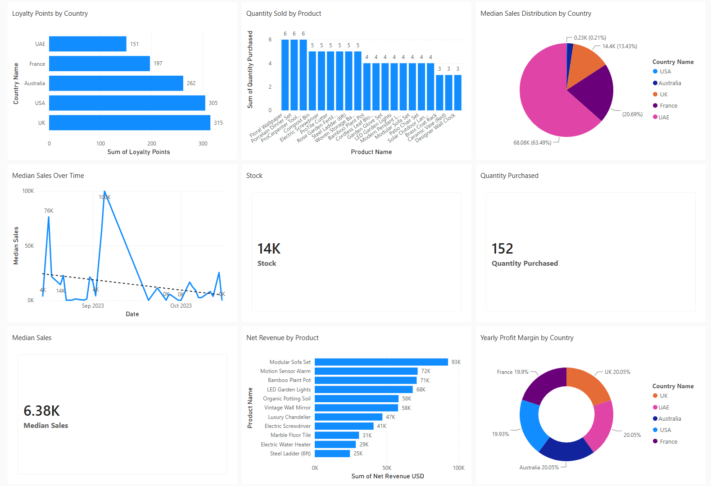
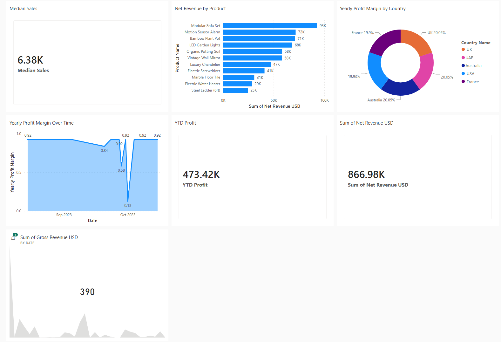
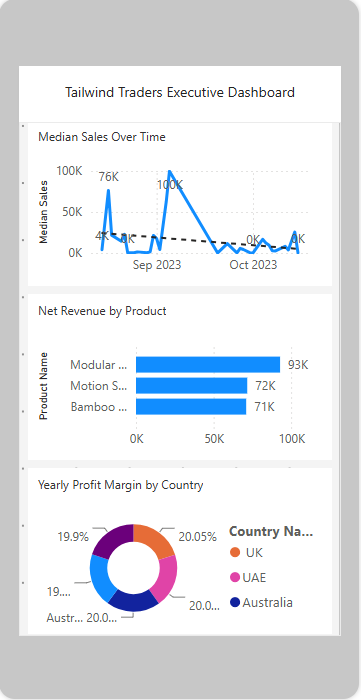
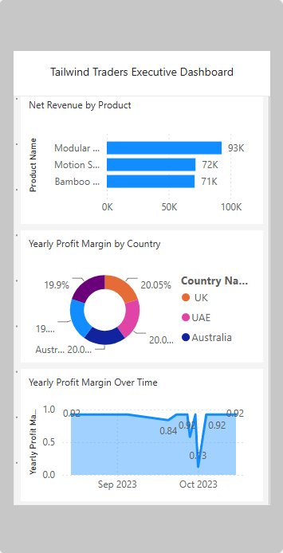

# Tailwind Traders Business Intelligence Dashboard

A guided Power BI capstone completed through the [Microsoft Power BI Data Analyst Professional Certificate](https://www.coursera.org/professional-certificates/microsoft-power-bi-data-analyst) on Coursera. The project turns supplied business data into an executive report covering sales, profitability, inventory, products, countries, and customer loyalty.

## My Contribution

- Transformed and prepared the supplied data with Power Query.
- Built the relational data model used by the report.
- Created DAX measures and KPI cards.
- Designed desktop report pages with filtering and navigation.
- Built a dedicated mobile layout.
- Published the report to Power BI Service and configured report delivery features.

## Business Questions

- Which products contribute the most net revenue?
- How are sales, profit, and inventory changing over time?
- How do countries compare across sales and loyalty indicators?
- Can executives review the core KPIs from both desktop and mobile layouts?

## Report Snapshot

The included report screenshots show the following values for the supplied capstone dataset:

- **866.98K** net revenue
- **473.42K** year-to-date profit
- **14K** units of stock
- **152** units purchased
- **93K** net revenue for the highest-ranked product shown, Modular Sofa Set

These are portfolio exercise outputs, not live Tailwind Traders business results.

## Desktop Report

### Executive overview



### Profitability and product performance



<details>
<summary>Mobile-layout evidence</summary>

The repository also includes mobile-layout screenshots. They demonstrate the responsive report work completed during the capstone; further label and spacing refinement is planned before treating the layout as production-ready.





</details>

## Repository Structure

```text
powerbi-capstone-project/
├── Tailwind Traders Report.pbix
├── screenshots/
│   ├── first.png
│   ├── second.png
│   ├── third.png
│   ├── fourth.png
│   ├── fifth.png
│   └── sixth.png
└── README.md
```

## Skills Demonstrated

- Power Query data preparation
- Relational data modeling
- DAX measures and KPI design
- Business intelligence reporting
- Interactive filtering and navigation
- Desktop and mobile report design
- Power BI Service publishing

## Validation Note

This repository documents a guided learning project. Before operational use, measure definitions, percentage formatting, aggregation labels, and mobile text truncation should be independently reviewed. The `.pbix` file is included for direct inspection in Power BI Desktop.

