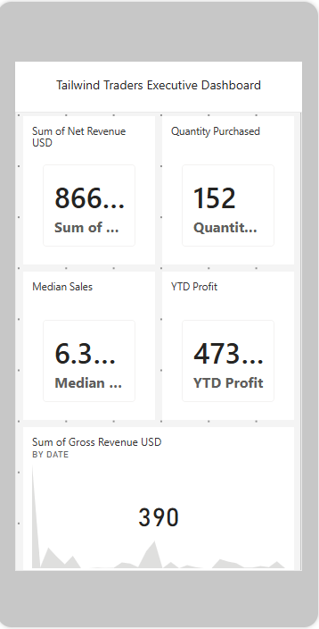
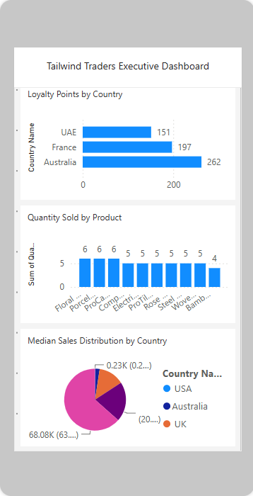

# Tailwind Traders Business Intelligence Dashboard

A Power BI capstone project focused on sales, profitability, inventory and customer-loyalty reporting for the fictional Tailwind Traders business.

## Business Objective

Transform raw operational data into an interactive management report that helps users monitor performance, investigate trends and access a mobile-optimized version of the report.

## Work Completed

- Cleaned and transformed data with Power Query.
- Built a relational data model.
- Created DAX measures and KPI cards.
- Designed interactive report pages with slicers and filters.
- Added sales, profit, inventory, country and loyalty analysis.
- Created a dedicated mobile layout.
- Published the report to Power BI Service and configured report subscriptions.

## Technologies

- Microsoft Power BI Desktop
- Power BI Service
- Power Query
- DAX
- Data modeling

## Repository Structure

```text
powerbi-capstone-project/
├── Tailwind Traders Report.pbix
├── screenshots/
│   ├── first.png
│   ├── second.png
│   ├── third.png
│   ├── fourth.png
│   ├── fifth.png
│   └── sixth.png
└── README.md
```

## Report Screenshots

### Report view 1


### Report view 2


### Report view 3


### Report view 4


### Report view 5


### Report view 6


## Skills Demonstrated

- Business intelligence reporting
- ETL with Power Query
- Star-schema and relationship design
- DAX measures and KPIs
- Interactive filtering and navigation
- Mobile report optimization
- Power BI Service publishing

## Notes

The `.pbix` file is included for direct review in Power BI Desktop. Because Power BI binary files cannot be meaningfully reviewed as plain source code on GitHub, the screenshots provide a browser-visible preview of the completed work.
